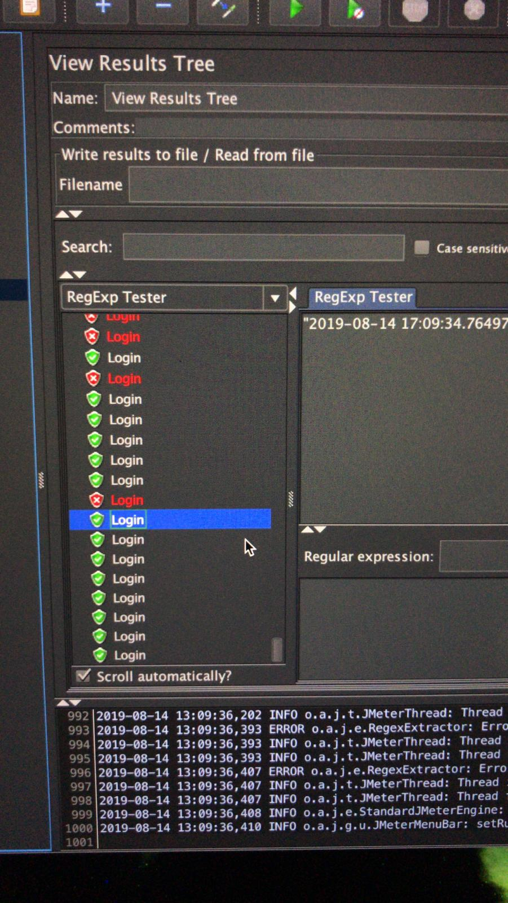

# Cloud computing with Amazon Web Services


#### Deploying web applcaition on AWS
Summary: In this project, a library management system web application is deployed on Amazon Web Services cloud platform. In which - 
  - EC2 instances are [auto-scaled](https://docs.aws.amazon.com/autoscaling/ec2/userguide/what-is-amazon-ec2-auto-scaling.html) with Elastic load balancer [ELB](https://aws.amazon.com/elasticloadbalancing/) to handle web traffic.
  - The applciation is running on my domain *csye6225-su19-deogade.me* which is a hosted zone on [Route53](https://aws.amazon.com/route53/).
  - Networking resources in AWS essential for hosting app on virtual private cloud [VPC](https://aws.amazon.com/vpc/) were created with [cloudformation](infrastructure/aws/cloudformation/csye6225-cf-networking.yaml) yaml script and automated with [bash](infrastructure/aws/cloudformation/csye6225-aws-cf-create-stack.sh) scripts.
  - The user is sent a password reset email via Simple Email Service [SES](https://aws.amazon.com/ses/) by subscribing to Simple Notification Service [SNS](https://docs.aws.amazon.com/ses/latest/DeveloperGuide/notifications-via-sns.html).
  - The user's email record is stored in [DynamoDB](https://aws.amazon.com/dynamodb/) table with a 15 minutes time-to-live [TTL](https://docs.aws.amazon.com/amazondynamodb/latest/developerguide/TTL.html).
  - The functionality operates on [serverless](https://www.cloudflare.com/learning/serverless/what-is-serverless/) computing with [Lambda funtion](https://docs.aws.amazon.com/lambda/latest/dg/python-programming-model-handler-types.html).
  - Images for books are stored in [S3 bucket](https://docs.aws.amazon.com/AmazonS3/latest/dev/UsingBucket.html).
  - [Code deploy](https://aws.amazon.com/codedeploy/) bundle is stored in different S3 bucket.

## Technology stack</br>
1. Developed using Flask - a micro web framework written in Python.
2. Plugged with uWSGI application server to launch the application.
3. Nginx to act as a front end reverse proxy.
4. Uses MySql for the relational database.
5. Served on CentOS7.


## Mysql database
#### Person

Field | Type | Null | Key | Default
 --- | --- | --- | --- | ---
id            | varchar(100)       |   No  |PRI  |  NULL
username    | varchar(100)  |   Yes |     |  NULL   
password    | varchar(100)  |   Yes |     |  NULL   
 
#### Books

| Field | Type | Null | Key | Default |
| --- | --- | --- | --- | --- |
|id            | varchar(100)       |   No  |PRI  |  NULL    |
|title    | varchar(100)  |   Yes |     |  NULL    |
|timeofcreation    | varchar(100)  |   Yes |     |  NULL    |
</br>

***An additional field of "time of creation" is added in books table to maintain time-to-live of DynamoDB*** </br>
#### Image

| Field | Type | Null | Key | Default |
| --- | --- | --- | --- | --- |
|id            | varchar(100)       |   No  |PRI  |  NULL    |
|url    | varchar(100)  |   Yes |     |  NULL    |

## Cloudformation
#### Automating creation of all aws resources
- security groups - web, instance, rds
- internet gateway, VPC, subnets, route table
- dynamodb, rds, instance
- roles, policies
- user data to send to instance
***scripts can be found [here](/infrastructure/aws/cloudformation)***


## CI/CD
  - CircleCI and AWS code-deploy are integraeted together in config.yaml script to test, zip and upload the all web applciation files onto code-deploy S3 bucket. 
  - While auto-scaling with load balancer, initially code will be deployed on 3 instances. 
  - Any changes made to master branch will trigger a new build
  - refer [appsepec.yml](appspec.yml) file in the root of the repository


#### Build instructions
Requirements: 
- API testing tool - install Reslet plugin, which is a chrome's extension
- User need to have two S3 buckets:</br>
  e.g. for webapp: yourdomain.tld 
       for code deploy: code-deploy.yourdomain.tld  
  where yourdomain.tld should be replaced with your domain name</br>
    ```bash
    git clone git@github.com:Adhira-Deogade/cloud-computing-aws.git
    cd cloud-computing-aws/webapp
    ```
- Run a build through API without having to make any commit to master:</br>
  ```bash
  curl -u e7dc1223f96c97299b257a6cb26bffd9cf897bdc -d build_parameters[CIRCLE_JOB]=build https://circleci.com/api/v1.1/project/github/Adhira-Deogade/cloud-computing-aws/tree/master
  ```
- refer [config.yml](.circleci/config.yml) file in .circleci folder

#### Deploy instructions

```bash
aws configure set region us-east-1 && aws deploy create-deployment --application-name csye6225-webapp --deployment-config-name CodeDeployDefault.AllAtOnce --deployment-group-name csye6225-webapp-deployment --description "My demo deployment" --s3-location bucket=$S3_BUCKET,bundleType=zip,key=webapp.zip 
```
## Identity Access Management([IAM](https://docs.aws.amazon.com/IAM/latest/UserGuide/id.html)) roles and policies

#### 1. Group
Three groups: 
  1. Administrator with *admin access*
  2. Staff with *read only access*
  3. Team with *read only access*

#### 2. Users
  - 3 users as teaching staff
  - 3 users as team members
  - all having accesss to sign in into console with key and password (only read the resources)
  - 1 user with programmatic access - create and delete resources
  - All users assigned to respective groups
  
#### 3. Roles and policies </br>
5 roles:
  1. Auto scaling service role has an attached policy of managing EC2 instances, cloud-watch agent, load balancer, instance profile, and simple notification service
  2. Elastic load balancer service role has an attached policy of managing network interface with instance, and logging.
  3. RDS service role has an attached policy of managing, logging, kinesis, and interfacing with instance.
  4. Support service role has an attached policy of supporting EC2, RDS, logging, cloudwatch, RDS, IAM, ELB, codebuild, codedeploy, cloudformation, api, s3, web-application-firewall.
  5. Trusted role with policy to manage trusted resources.
Apart from AWS managed policies, I created following policies to manage aws resources:

## Auto-scaling of EC2 instances


- Auto scaling is important to make sure that the application is running irrespective of the load on the web-server.
- If there are around 1000 users simultaneously access the application, the server needs scaling and automatically new instances will be created, up and running to handle those API requests.
- I deployed the application on 3 EC2 instances and scaled max to 5 instances.
- Auto scaling group with attached security groups make it simple to manage the instances and code deployment.

## Serverless computing - restting password
#### Lambda function

- This runs code in response to events and automatically manages the computing resources required by that code.
- This function is invoked when user requests to reset password through API.
- It subscribes to SNS topic
- Called "handler function"

#### Simple Notification service ([SNS](https://aws.amazon.com/blogs/aws/introducing-the-amazon-simple-notification-service/))

- This event is triggered when API is hit
- Since lambda function is subscribed to this topic, it is executed when this event is triggered

#### Simple Email Service
- Email is composed with sender, receiver, subject and body
- Email is sent from the domain's MX record

#### DynamoDB table
- Users email is stored in DynamoDB table
- TTL record field is defined during table creation
- python boto3 client will set it to 15 minutes in [epoch time](https://www.epochconverter.com/) format
- after 15 minutes, the record loses its validity and sender needs to get another reset email

#### Integration:


## Security


#### HTTPS
- Create an SSL certificate from [here](https://aws.amazon.com/certificate-manager/)
- Validate with DNS by creating a CNAME record in [Route 53](https://aws.amazon.com/route53/)
- To manage HTTPS traffic from load balancer to auto scaling group instances, SSL certificate is essential

#### Security groups
  1. Web app security group - incoming and outgoing traffic to web application - open port 80
  2. Databse security group - incoming and outgoing traffic to RDS instance - only web app can access the database and no one else outside the network. port 3306
  3. ELB security group -  - incoming from 8080 and outgoing traffic 80 (webapp)

#### Elastic load balancer
To handle multiple http requests to web server, load balancer comes into effect


## Python - SDK

#### [boto3 client](https://boto3.amazonaws.com/v1/documentation/api/latest/index.html) to create and implement aws resources
- s3 bucket - uploading images
- generating pre-signed url - A user who does not have AWS credentials or permission to access an S3 object can be granted temporary access by using a presigned URL. 
- email service (SES)
- notification service (SNS)

 ## CloudWatch
  - Cloudwatch [agent](webapp/amazon-cloudwatch-agent.json) (a json file) needs to be placed in the system on which the web server is running.
  - It is setup in EC2 instances by installing them in the amazon machine image ([AMI](firstinstance.sh)) - CentosOS7
    ```bash
    wget https://s3.us-east-1.amazonaws.com/amazoncloudwatch-agent-us-east-1/centos/amd64/latest/amazon-cloudwatch-agent.rpm
    sudo rpm -U ./amazon-cloudwatch-agent.rpm
    ```
#### 1. Cloudwatch logs
  - To continously monitor web applcaition, use cloudwatch [logs](https://docs.aws.amazon.com/AmazonCloudWatch/latest/monitoring/Install-CloudWatch-Agent.html).
  - Setting up logging [config](https://flask.palletsprojects.com/en/1.0.x/logging/) to lowest level of *INFO*, all important and trivial logs can be captured.


#### 2. Cloudwatch metrics
  - Metrics help to understand the value of each API end point. To obtain the frequency, metrics can be used.
  - In combination with [statsd](https://github.com/statsd/statsd), flask-API end points can be monitored with AWS cloud watch.


## jmeter load testing
To test the auto-scaling of EC2 instances through load balancer, 1000 api requests are made continuously to increase load on web-server by calling following end-points -
  - register user
  - login
  - register book
  - get book details
  - upload image to book
#### Result:



## Running Tests</br>
  -   ``` pytest <filename>.py```
  - Open Restlet and test the following [web end points](https://app.swaggerhub.com/apis-docs/csye6225/csye6225-summer2019/3.0.0#/public/post_reset) -

| No. | Http request type | Url | Variables | Authorization | Response |
| --- | --- | --- | --- | --- | --- |
| 1 | GET | / | - | No auth | "Unauthorized" |
| 2 | POST | /user/register | username: "", Password: "" | No auth | "User registered", "User already exists" |
| 3 | GET | / | - | Basic auth | current time |
| 4 | POST | /book | title: "", author: "", isbn: "", quantity: "" | Basic auth | "Book registered" |
| 5 | GET | /book | - | Basic auth | All books in json |
| 6 | GET | /book/{book_id} | - | Basic auth | Details of single book |
| 7 | PUT | /book/{book_id} | title: "", author: "", isbn: "", quantity: "" | Basic auth | "Book updated" |
| 8 | DELETE | /book/{book_id} | - | Basic auth | No content |
| 9 | POST | /book/{book_id}/image | form-file: ("select-file") | Basic auth | Details of book with image id and url |
| 10 | PUT | /book/{book_id}/image/{image_id} | form-file: ("select file") | Basic auth | Details of book with image id and url |
| 11 | GET | /book/{book_id}/image/{image_id} | - | Basic auth | Details of book with image id and url |
| 12 | DELETE | /book/{book_id}/image/{image_id} | - | Basic auth | No content |
| 13 | POST | /reset | username: "" | No auth | "Password reset email sent" |

## Team Information

| Name | NEU ID | Email Address |
| --- | --- | --- |
| Anuja Thawali|001898170 |thawali.a@husky.neu.edu |
| Supriya Patil|001449828 |patil.sup@husky.neu.edu |
| Adhria Deogade |001873261| deogade.a@husky.neu.edu|
